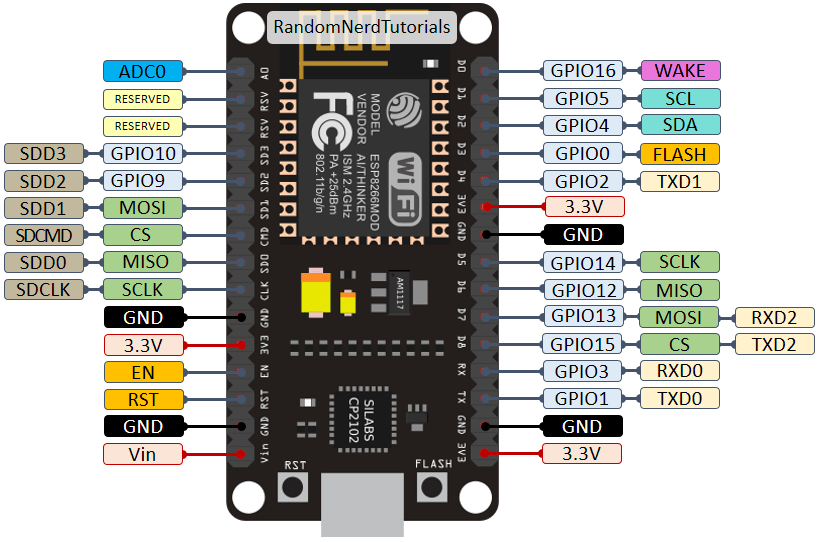

# Standing Desk Presets

Simple NodeMCU ESP8266 API and mechanism for raising/lowering standing desk without having to move your hands from your keyboard. This can be used to set desks heights to a desired preset.

## Installation

Parts:
- [NodeMcu ESP8266](https://www.amazon.ca/NodeMcu-ESP8266-CH340G-Internet-Development/dp/B01KKH26L8) (Wifi Module)<!-- - [Uno Arduino](https://www.amazon.ca/Arduino-Development-Microcontroller-Atmega328p-Straight/dp/B07M87FYPD/ref=sr_1_9?keywords=uno+arduino&qid=1581963869&s=electronics&sr=1-9) (5V power supply for Relays and Ultrasonic Sensor) -->
- [2 Channel Relay](https://www.amazon.ca/gp/product/B00E0NTPP4/ref=ppx_yo_dt_b_asin_title_o00_s00?ie=UTF8&psc=1) (1 Channel each, Up/Down)
- [Ultrasonic Sensor HC-SR04](https://www.amazon.ca/Smraza-Ultrasonic-Distance-Mounting-S03-CN/dp/B071P91YDS/ref=sr_1_1_sspa?crid=1B64JWW4UDVNV&keywords=ultrasonic+sensor&qid=1581965103&s=electronics&sprefix=Ultrasonic+Sensor%2Celectronics%2C193&sr=1-1-spons&psc=1&spLa=ZW5jcnlwdGVkUXVhbGlmaWVyPUEyTzFHOEdUUUYwN0xXJmVuY3J5cHRlZElkPUExMDIwMDk3MU42STZQTFFXNlNMViZlbmNyeXB0ZWRBZElkPUEwMTcyNDkxMjJWN0o1QkdHN0dEViZ3aWRnZXROYW1lPXNwX2F0ZiZhY3Rpb249Y2xpY2tSZWRpcmVjdCZkb05vdExvZ0NsaWNrPXRydWU=) (For adjusting to preset)

Use the package manager PIP to install foobar.

```bash
pip install esptool
```

Download the esp8266 micropython firmware, this was tested with esp8266-20191220-v1.12.bin [here](http://micropython.org/download#esp8266)

```bash
esptool.py --port /dev/cu.SLAB_USBtoUART erase_flash
esptool.py --port /dev/cu.SLAB_USBtoUART --baud 460800 write_flash --flash_size=detect -fm dio 0 esp8266-20191220-v1.12.bin
```

Install ampy to transfer files to nodemcu file system:
```bash
pip install adafruit-ampy
```

Micropython firmware expects a boot.py, and a main.py, that will run in that respective order.
```bash
ampy --baud 115200 --port /dev/cu.SLAB_USBtoUART put boot.py
ampy --baud 115200 --port /dev/cu.SLAB_USBtoUART put main.py
```

## Usage

```bash

```

## Useful Information:
### ESP8266 12E Pin Diagram

